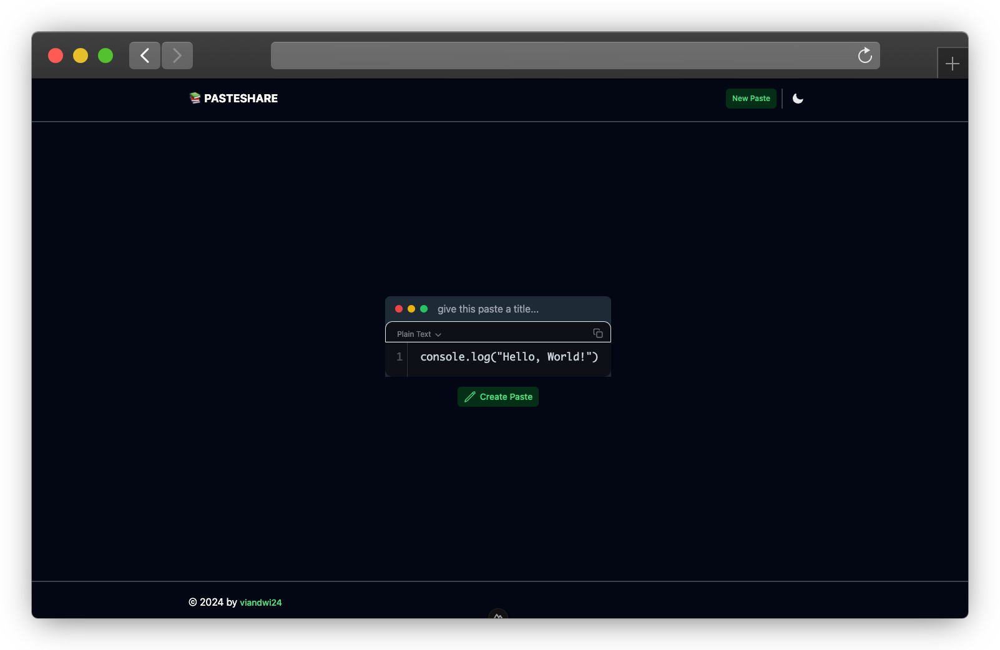

# 📚 pasteshare
a simple app to share your text snippets, get a anonymous link and share it with your friends easily.

## Features
- Share your text snippets with your friends
- Get a anonymous link to share
- No registration required
- No tracking
- No ads

## Tech Stack
- Frontend: [Nuxt 3](https://nuxt.com)
- Backend: [Go](https://golang.org)
- Database: [PostgreSQL](https://www.postgresql.org)
- Development Tools: [Docker](https://www.docker.com)

## Libraries used
- [nuxt/ui](https://github.com/nuxt/ui)
- [vue-simple-code-editor](https://github.com/justcaliturner/simple-code-editor)
- [godotenv](https://github.com/joho/godotenv)
- [go-chi](https://github.com/go-chi/chi)
- [golang-migrate](https://github.com/golang-migrate/migrate)
- [sqlx](https://github.com/jmoiron/sqlx)
